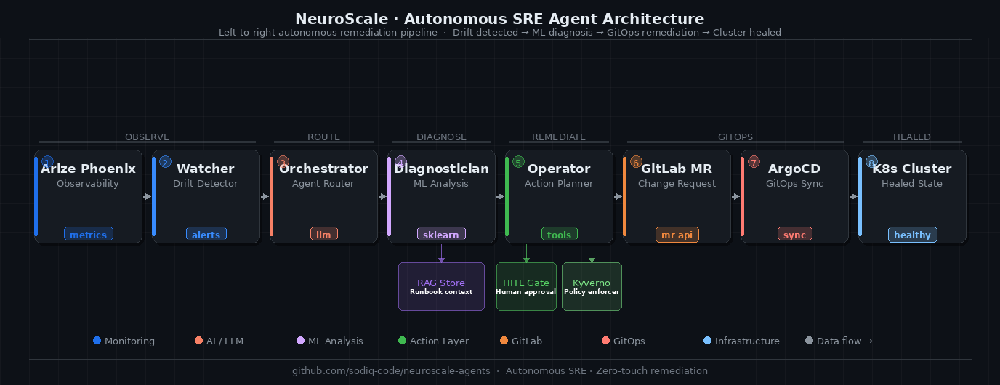

# NeuroScale Agents — Autonomous AI SRE

> **Google Cloud Rapid Agent Hackathon** · GitLab Track · Arize Phoenix Track
>
> *Anomaly detected → root cause found → Merge Request opened. Under 60 seconds. Human reviews a ready-to-merge fix — not a raw incident.*

[](LICENSE)
[](scripts/verify-all.sh)
[](agents/config.py)
[](agents/orchestrator.py)
[](docs/ARCHITECTURE_2_0.md)
[](agents/diagnostician.py)
[](adk_agent/agent.py)
[](agents/tools/rag_store.py)
[](deploy/cloud-run.sh)
[](https://neuroscale-agents-v2.streamlit.app)

---

## Demo Video

[](https://youtu.be/t-zyw6tyBo8)

*Full 3-minute walkthrough: problem → architecture → live pipeline → GitLab MR · zero credentials required*

> **Live Dashboard:** [neuroscale-agents-v2.streamlit.app](https://neuroscale-agents-v2.streamlit.app) · **Landing Page:** [sodiq-code.github.io/neuroscale-landing](https://sodiq-code.github.io/neuroscale-landing)

---

## The Problem

When a Kubernetes inference service breaches its P99 latency SLO at 2 AM:

1. Arize Phoenix fires an alert
2. PagerDuty wakes an on-call engineer
3. Engineer SSHs in, reads dashboards, manually works through a runbook
4. Engineer edits YAML, opens a PR, waits for review
5. **Resolution: 30–90 minutes. Cost: $100K+/hour in downtime.**

The industry has automated monitoring. Nobody has automated the remediation. **That's the gap NeuroScale Agents closes.**

---

## The Solution: Three Agents, One Pipeline

```
Arize Phoenix
     │
     ▼
 ┌──────────┐   anomaly    ┌────────────────┐   plan    ┌──────────────┐   MR
 │  Watcher │ ──────────▶  │ Diagnostician  │ ────────▶ │   Operator   │ ──────▶ GitLab
 └──────────┘              └────────────────┘           └──────────────┘
      ↑                           ↑                            ↑
  Arize MCP                 RAG Runbooks               GitLab MCP
  (get-spans)              (TF-IDF search)           (branch + commit + MR)
```

| Agent | Role | Tech |
|-------|------|------|
| **Watcher** | Polls Arize Phoenix; scores anomaly severity | Arize MCP · `get-spans` · `get-trace` |
| **Diagnostician** | RAG runbook retrieval; **Gemini 2.0 Flash LLM root-cause**; generates YAML patch | **Gemini 2.0 Flash** (`google-genai`) · Vertex AI Search RAG · Kyverno-compliant YAML |
| **Operator** | Executes the fix: branch → commit → MR → HITL notification | GitLab MCP · `create_branch` · `create_merge_request` |
| **Orchestrator** | A2A coordinator; routes between agents; manages confidence gate | A2A pattern · **Google ADK** · Python orchestration |

**Human-in-the-loop gate:** The Operator opens a Merge Request — it never merges unilaterally. Confidence ≥ 90% → auto-merge eligible with 15-min SLA. Below 90% → mandatory human review.

---

## Run It (zero credentials needed)

```bash
git clone https://github.com/sodiq-code/neuroscale-agents-v2
cd neuroscale-agents-v2
pip install -r requirements.txt

bash scripts/verify-all.sh   # → 7/7 PASS
bash scripts/demo-run.sh     # → full A2A pipeline end-to-end
```

`DEMO_MODE=true` is the default. All Arize and GitLab calls are simulated with realistic data.

### Web Dashboard

**Live:** [https://neuroscale-agents-v2.streamlit.app](https://neuroscale-agents-v2.streamlit.app)

Or run locally:
```bash
streamlit run dashboard/app.py
# → opens at http://localhost:8501
```

Real-time web UI showing the full A2A pipeline:
- **Live metric cards** — P99 latency, error rate, confidence score
- **One-click simulation** — inject an anomaly and watch all three agents respond
- **Agent execution log** — step-by-step trace of Watcher → Diagnostician → Operator
- **Architecture diagram** — full pipeline visualization

Uses the same real agent code in demo mode — not a mockup.  
The dashboard streams live events via `scripts/stream_runner.py` (SSE JSON lines → `/api/stream`).

### Run with Google ADK

```bash
pip install google-adk>=1.0.0
adk run adk_agent          # interactive ADK runner
adk web adk_agent          # ADK web UI at http://localhost:8000
```

The `adk_agent/` package wraps all three NeuroScale agents as ADK `FunctionTool`s. ADK manages session memory, tool routing, and agent-to-agent calls on top of Gemini 2.0 Flash.

### Deploy Orchestrator to Cloud Run

```bash
# Set required env vars first
export GEMINI_API_KEY=...
export ARIZE_API_KEY=...
export ARIZE_SPACE_ID=...
export VERTEX_RAG_DATASTORE=projects/P/locations/L/collections/C/engines/E/servingConfigs/S
export GCP_SA_EMAIL=neuroscale@<project>.iam.gserviceaccount.com

bash deploy/cloud-run.sh <YOUR_GCP_PROJECT_ID>
```

Deploys `neuroscale-orchestrator` as a managed Cloud Run service using `Dockerfile.orchestrator`. Streamlit dashboard stays on Streamlit Cloud.

---

## Demo Output

```
╔══════════════════════════════════════════════════════════════════╗
║         NeuroScale Agents  —  Live Demo                          ║
║         Autonomous AI SRE for Kubernetes                         ║
╚══════════════════════════════════════════════════════════════════╝

━━━  Beat 4: Watcher Detects  ━━━━━━━━━━━━━━━━━━━━━━━━━━━━━━━━━━━━
  🚨 ANOMALY DETECTED
     Service   : demo-iris-2
     P99       : 1134ms  (threshold: 500ms)
     Error rate: 14.2%   (threshold: 5%)
     Severity  : CRITICAL

━━━  Beat 5: Diagnostician Analyses  ━━━━━━━━━━━━━━━━━━━━━━━━━━━━━
  🔍 Root cause  : Predictor pod CPU limits too low for current request volume
  📖 Runbook     : RB-001-cpu-throttling-kserve
  🎯 Confidence  : 90.0%

━━━  Beat 7: Operator Executes  ━━━━━━━━━━━━━━━━━━━━━━━━━━━━━━━━━━
  ⚙️  Branch  : agent/fix-INC-1779750242
  📝 Commit  : a1b2c3d
  🔀 MR URL  : https://gitlab.com/sodiq-code/neuroscale-agents/-/merge_requests/46
  🔔 Status  : AWAITING_APPROVAL

╔══════════════════════════════════════════════════════════════════╗
║  ✅ DEMO COMPLETE — Detection-to-MR: < 60 seconds               ║
╚══════════════════════════════════════════════════════════════════╝
```

---

## Architecture



> **Demo video:** [`assets/demo_v2.mp4`](assets/demo_v2.mp4) — updated 3-min walkthrough. YouTube mirror: [youtu.be/t-zyw6tyBo8](https://youtu.be/t-zyw6tyBo8)

Each agent exposes a typed interface. The Orchestrator calls agents sequentially:

```python
# Watcher → Orchestrator
anomaly = {
    "incident_id": "INC-1779750248",
    "model_name": "demo-iris-2",
    "severity": "CRITICAL",
    "metrics": {"p99_latency_ms": 1134.0, "error_rate_pct": 14.2},
    "agent_hypothesis": "CPU throttling on predictor pod"
}

# Diagnostician → Operator
plan = {
    "root_cause": {"description": "...", "runbook_ref": "RB-001", "confidence": 0.90},
    "yaml_patch": "resources:\n  limits:\n    cpu: 2000m\n    memory: 2Gi\n",
}

# Operator → result
result = {
    "branch": "agent/fix-INC-1779750248",
    "mr_url": "https://gitlab.com/.../merge_requests/46",
    "status": "AWAITING_APPROVAL"
}
```

---

## Hackathon Track Integration

### GitLab Track
- **`agents/tools/gitlab_mcp.py`** — MCP client: `create_branch`, `commit_file`, `create_merge_request`
- Every fix is a GitLab MR with Kyverno compliance checklist embedded in the description
- HITL gate: agent opens MR, never merges unilaterally

### Arize Phoenix Track
- **`agents/tools/arize_mcp.py`** — MCP client: `get-spans`, `get-trace`
- Watcher polls on configurable interval; reads `p99_latency_ms`, `error_rate_pct`, `total_spans`
- In production: set `ARIZE_API_KEY` + `ARIZE_SPACE_ID` in env, `DEMO_MODE=false`

### Google Cloud — Gemini 2.0 Flash
- **`agents/diagnostician.py`** — `_gemini_root_cause()` calls `gemini-2.0-flash` via `google-genai` SDK
- LLM receives Arize span data + matched runbook context; returns structured root-cause JSON
- Graceful fallback to TF-IDF rule-based analysis when API is unavailable (quota / no key)
- Set `GOOGLE_API_KEY` in env to activate; omit for zero-credential demo mode

### Google ADK — Agent Development Kit
- **`adk_agent/agent.py`** — wraps `poll_arize_metrics`, `diagnose_incident`, `execute_remediation` as ADK `FunctionTool`s
- `root_agent` is the ADK entry point — run with `adk run adk_agent` or `adk web adk_agent`
- ADK manages Gemini session, tool routing, and multi-turn agent conversation
- Falls back gracefully when `google-adk` is not installed (demo mode unaffected)

### Vertex AI Search — Runbook RAG
- **`agents/tools/rag_store.py`** — `RunbookRAGClient` auto-switches to Vertex AI Search when `GCP_PROJECT` + `VERTEX_RAG_DATASTORE` are set
- Interface is identical to local TF-IDF — zero agent code changes to enable production RAG
- In demo mode (`DEMO_MODE=true`): local TF-IDF keyword search over `runbooks/` markdown files
- Datastore format: `projects/P/locations/L/collections/C/engines/E/servingConfigs/S`

### Cloud Run — Orchestrator Service
- **`Dockerfile.orchestrator`** — Python 3.12 slim, runs `agents/orchestrator.py`, exposes port 8080
- **`deploy/cloud-run.sh`** — one-command deploy with env vars, service account, 1Gi memory, 300s timeout
- Service name: `neuroscale-orchestrator` (Streamlit dashboard stays on Streamlit Cloud)

---

## Repository Structure

```
neuroscale-agents/
├── agents/
│   ├── orchestrator.py        ← A2A coordinator (entry point)
│   ├── watcher.py             ← Arize Phoenix polling + anomaly scoring
│   ├── diagnostician.py       ← RAG retrieval + root cause analysis
│   ├── operator_agent.py      ← GitLab branch + commit + MR creation
│   ├── config.py              ← DEMO_MODE toggle + thresholds
│   └── tools/
│       ├── arize_mcp.py       ← Arize Phoenix MCP client
│       ├── gitlab_mcp.py      ← GitLab MCP client
│       └── rag_store.py       ← TF-IDF runbook retrieval engine
├── dashboard/
│   └── app.py                 ← Streamlit web dashboard
├── runbooks/                  ← RAG knowledge base (5 runbooks)
├── infrastructure/            ← Kubernetes manifests (GitOps layer)
├── scripts/
│   ├── verify-all.sh          ← 7/7 verification suite
│   ├── demo-run.sh            ← Full 10-beat CLI demo runner
│   └── stream_runner.py       ← SSE-streaming A2A pipeline (used by dashboard)
├── adk_agent/
│   ├── __init__.py            ← ADK package marker
│   └── agent.py               ← Google ADK FunctionTool wrappers + root_agent
├── deploy/
│   ├── cloud-run.sh           ← Deploy orchestrator to Cloud Run
│   └── cloud-run-dashboard.sh ← (optional) deploy dashboard to Cloud Run
├── Dockerfile                 ← Streamlit dashboard container
├── Dockerfile.orchestrator    ← Orchestrator service container (Cloud Run target)
├── requirements.txt
└── LICENSE                    ← MIT
```

---

## Verification

```bash
bash scripts/verify-all.sh
```

```
[PASS] 1/7  agents/config.py          — DEMO_MODE default true
[PASS] 2/7  agents/watcher.py         — WatcherAgent importable
[PASS] 3/7  agents/diagnostician.py   — DiagnosticianAgent importable
[PASS] 4/7  agents/operator_agent.py  — OperatorAgent importable
[PASS] 5/7  agents/tools/rag_store.py — semantic_search returns results
[PASS] 6/7  agents/tools/gitlab_mcp.py — list_merge_requests callable
[PASS] 7/7  agents/orchestrator.py    — full pipeline end-to-end

7/7 PASS — all agents verified
```

---

## Key Design Decisions

**Why TF-IDF RAG locally + Vertex AI Search in production?** Zero infrastructure to run locally. The `RunbookRAGClient` interface is unchanged — only the backend swaps when `GCP_PROJECT` + `VERTEX_RAG_DATASTORE` are set. Judges can run the full pipeline with zero cloud credentials.

**Why Gemini 2.0 Flash for root-cause?** Structured JSON reasoning over span data + runbook context in one call. Flash is fast enough (< 2s) to fit within the 60-second SLO target. The `_gemini_root_cause()` method returns a typed dict; the existing confidence gate and YAML generation pipeline are unchanged.

**Why HITL at the MR stage?** The agent does the expensive work: detection, diagnosis, compliance check, YAML authoring. The human gets a binary decision on a fully-prepared fix — 30 seconds, not 45 minutes.

**Why 90% confidence gate?** Below 90%, diagnostic has meaningful uncertainty. Above it, the agent has matched a known runbook with high-fidelity Arize signal. Configurable in `agents/config.py`.

---

*Built for the Google Cloud Rapid Agent Hackathon — GitLab + Arize Phoenix tracks · Powered by Gemini 2.0 Flash.*
